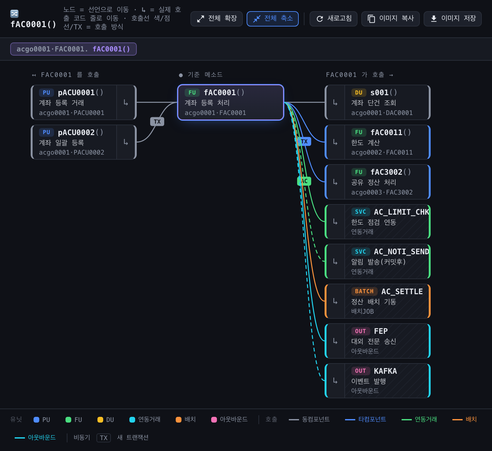
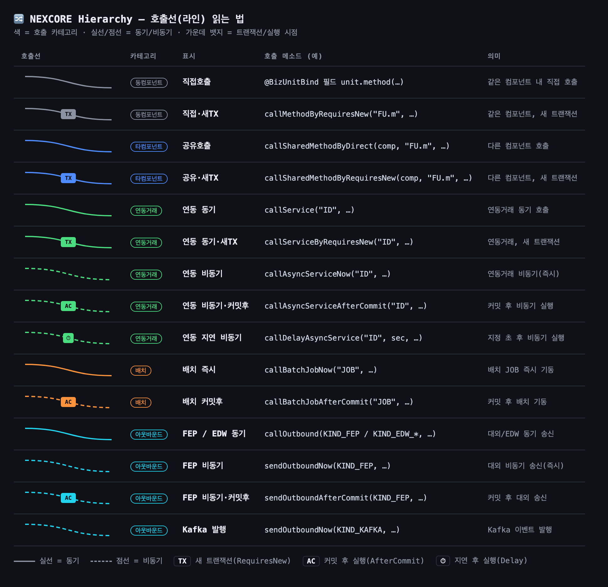

# NEXCORE Hierarchy

> **NEXCORE(BizUnit) 프레임웍의 컴포넌트 호출 구조**를 양방향 계층 그래프로 시각화하는 IntelliJ IDEA 플러그인



기준 메소드(ProcessUnit / FunctionUnit / DataUnit)를 중심으로 **무엇을 호출하는지(callee)** 와 **누가 호출하는지(caller)** 를 한눈에 보여줍니다. 직접 호출뿐 아니라 `call*` 표준 API를 통한 **타 컴포넌트 / 연동거래 / 배치 / 아웃바운드** 호출까지 추적하고, 각 호출선을 **종류(kind)별로 색·점선·TX 뱃지**로 구분합니다.

---

## ✨ 주요 기능

- **양방향 호출 계층** — 기준 메소드의 caller(피호출) ↔ callee(호출)를 컬럼 + 곡선 그래프로 표시
- **NEXCORE 두 호출 메커니즘 모두 추적**
  - `@BizUnitBind` 필드 직접 호출(local-call)
  - `AbstractBizUnit`의 `call*` / `sendOutbound*` 표준 API (문자열 ID 기반)
- **호출 종류(kind) 시각화** — 색 = 카테고리, 실선/점선 = 동기/비동기, `TX`·`AC`·`⏱` 뱃지 = 트랜잭션/실행 시점
- **노드 좌·우 테두리 색** — 각 노드로 들어오는 **호출선 카테고리 색을 노드 양쪽 테두리에 동일하게** 입혀, 선과 노드를 색으로 바로 연결
- **업무명 표시** — 각 노드에 `@BizMethod` 값 또는 Javadoc 첫 줄을 함께 표기
- **컴팩트 레이아웃** — 좁은 툴윈도우에서도 한 화면에 더 많은 호출 관계가 들어오도록 조밀하게 배치
- **전체 확장 / 전체 축소** — 연결된 모든 노드를 한 번에 펼치거나, 1차 연결만 보기
- **소스 점프** — 노드 클릭 = 메소드 선언으로 이동, `↳` 클릭 = 실제 호출 코드 줄로 이동
- **이미지 복사 / 저장** — 헤더~범례 전체를 PNG로 클립보드 복사하거나 파일 저장
- **새로고침** — 코드 변경 후 현재 기준 메소드로 다시 분석
- **단축키 `⌘⌃H`** — NEXCORE 프로젝트에서만 이 뷰를 띄우고, 그 외 프로젝트에서는 기본 *Method Hierarchy* 가 그대로 동작
- **구문(syntactic) 기반 분석** — 모듈/의존성이 연결되지 않은 stub 환경에서도 호출 관계를 잡아냄

## 🎨 호출선(라인) 읽는 법

호출선은 **3가지 시각 요소**로 호출 방식을 한 번에 표현합니다.

- **색 = 카테고리** — 동컴포넌트(회색) · 타컴포넌트(파랑) · 연동거래(초록) · 배치(주황) · 아웃바운드(청록)
- **선 모양 = 동기 여부** — 실선(동기) / 점선(비동기)
- **가운데 뱃지 = 트랜잭션·실행 시점** — `TX`(새 트랜잭션) · `AC`(커밋 후) · `⏱`(지연)

같은 색은 노드의 **좌·우 테두리**에도 그대로 입혀져, 어떤 호출선이 어떤 노드로 이어지는지 색만으로 바로 보입니다.



<details>
<summary>호출 종류(kind) 전체 표 — 메소드 ↔ 라인 매핑</summary>

| kind | 호출 표현 | 카테고리 / 색 | 선 스타일 |
|---|---|---|---|
| `local-call` | `@BizUnitBind` 필드 `unit.method(...)` | 동컴포넌트 / 회색 | 실선 |
| `local-new-tx` | `callMethodByRequiresNew(...)` | 동컴포넌트 / 회색 + `TX` | 실선 |
| `shared-call` | `callSharedMethodByDirect(...)` | 타컴포넌트 / 파랑 | 실선 |
| `shared-new-tx` | `callSharedMethodByRequiresNew(...)` | 타컴포넌트 / 파랑 + `TX` | 실선 |
| `linked-tx-sync` | `callService(...)` | 연동거래 / 초록 | 실선 |
| `linked-tx-sync-new` | `callServiceByRequiresNew(...)` | 연동거래 / 초록 + `TX` | 실선 |
| `linked-tx-async-now` | `callAsyncServiceNow(...)` | 연동거래 / 초록 | 점선 |
| `linked-tx-async-after-commit` | `callAsyncServiceAfterCommit(...)` | 연동거래 / 초록 + `AC` | 점선 |
| `linked-tx-delay-async` | `callDelayAsyncService(...)` | 연동거래 / 초록 + `⏱` | 점선 |
| `batch-now` | `callBatchJobNow(...)` | 배치 / 주황 | 실선 |
| `batch-after-commit` | `callBatchJobAfterCommit(...)` | 배치 / 주황 + `AC` | 점선 |
| `fep-sync` / `edw-sync` | `callOutbound(KIND_FEP / KIND_EDW_*, ...)` | 아웃바운드 / 청록 | 실선 |
| `fep-async-now` / `fep-async-after-commit` | `sendOutbound*(KIND_FEP, ...)` | 아웃바운드 / 청록 (+`AC`) | 점선 |
| `kafka-publish` | `sendOutboundNow(KIND_KAFKA, ...)` | 아웃바운드 / 청록 | 점선 |

</details>

## 🧩 노드 타입

| 뱃지 | 유닛 | 설명 |
|---|---|---|
| `PU` | ProcessUnit (`P*`) | 거래 진입점(endpoint) |
| `FU` | FunctionUnit (`F*`) | 업무 로직 |
| `DU` | DataUnit (`D*`) | DB 접근 |
| `SVC` | 연동거래 | 외부 서비스(소스 없음) |
| `BATCH` | 배치 JOB | 외부 배치(소스 없음) |
| `OUT` | 아웃바운드 | FEP / EDW / Kafka(소스 없음) |

## 📦 설치

### 1) 빌드한 플러그인 설치
```bash
./gradlew buildPlugin
```
생성된 `build/distributions/nexcore-hierarchy-0.1.0.zip` 을 IDE에 설치:

> **Settings/Preferences → Plugins → ⚙ → Install Plugin from Disk…** → 위 zip 선택 → IDE 재시작

### 2) 개발용 샌드박스 실행
```bash
./gradlew runIde
```

## 🚀 사용법

1. **NEXCORE 프로젝트**(프레임웍 `AbstractBizUnit` 을 포함한 프로젝트)에서 BizUnit 메소드(`pACU0001`, `fAC0001`, `s001` 등)에 커서를 둡니다.
2. **`⌘⌃H`** 를 누르거나, 우클릭 → **Show NEXCORE Hierarchy**.
3. 하단에 **NEXCORE Hierarchy** 툴윈도우가 열립니다.

| 조작 | 동작 |
|---|---|
| 노드 본문 클릭 | 메소드 선언으로 이동 + (기본 모드) 드릴다운 |
| `↳` 버튼 클릭 | 실제 호출 코드 줄(call-site)로 이동 |
| 상단 메뉴 | 전체 확장 · 전체 축소 · 새로고침 · 이미지 복사 · 이미지 저장 |
| 범례 클릭 | 유닛 타입 / 호출 카테고리 표시·숨김 토글 |

> `⌘⌃H` 는 macOS 기본 미할당 단축키를 사용합니다. **NEXCORE 프로젝트가 아닌 곳**에서는 IDE 기본 *Method Hierarchy* 로 자동 위임됩니다.

## ⚙️ 요구사항

- IntelliJ IDEA **2024.2 ~ 2025.3** (Community / Ultimate) — build `242` ~ `253`
  - JetBrains **Plugin Verifier** 로 2024.2 / 2024.3 / 2025.1 / 2025.2 / 2025.3 전 버전 호환 확인
- 빌드: **JDK 21**, **Gradle 9.5.1**, **Kotlin 2.2**

## 🔍 동작 방식

- 기준 메소드에서 **지연(lazy) 양방향 BFS** 로 그래프를 구성합니다.
- 호출의 판별/대상/kind는 모두 **구문(syntactic)** 으로 결정하므로 cross-file resolve가 안 되는 환경에서도 동작합니다.
  - 직접 호출 → `@BizUnitBind` 필드의 선언 타입명
  - `call*` → 메소드 이름 + 문자열 인자
- 대상 유닛 클래스는 `JavaPsiFacade` 가 실패하면 **파일명 인덱스(`<Unit>.java`)** 로 찾아 본문 확장·소스 점프를 지원합니다.

## 📁 구조

```
src/main/kotlin/com/nexcore/callflow/
├── NexcoreModel.kt            # CallKind(호출 종류) / NodeType / 분류 헬퍼
├── CallGraphAnalyzer.kt       # 양방향 호출 그래프 분석(구문 기반)
├── NexcoreHierarchy.kt        # 공통 로직 + NEXCORE 프로젝트 판별
├── NexcoreHierarchyAction.kt  # ⌘⌃H 액션(타 프로젝트는 Method Hierarchy 위임)
├── ShowCallFlowAction.kt      # 우클릭 메뉴 액션
├── CallFlowPanelService.kt    # JCEF 주입 / 소스 점프 / 이미지 / 새로고침
└── CallFlowToolWindowFactory.kt
src/main/resources/web/callflow.html   # 그래프 렌더링(JCEF 웹뷰)
```
